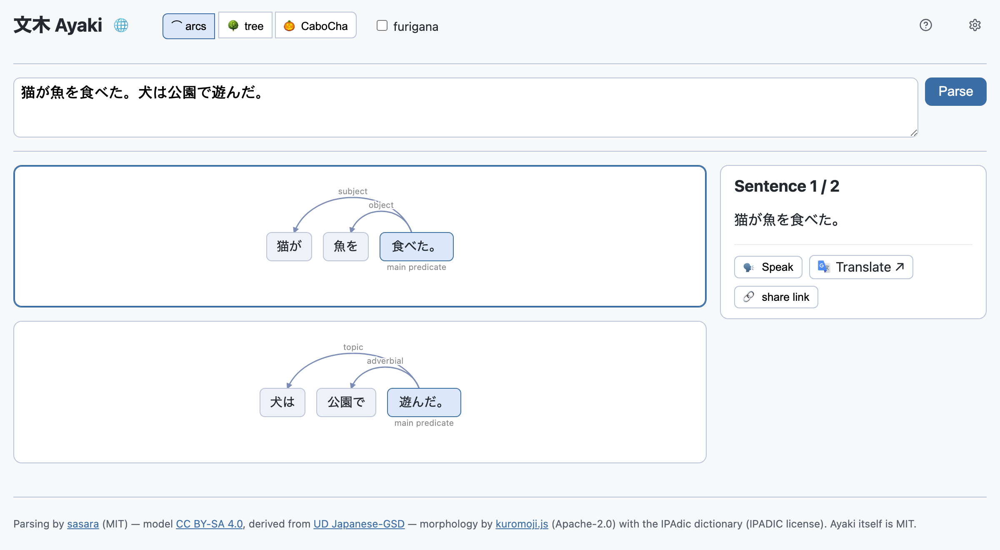
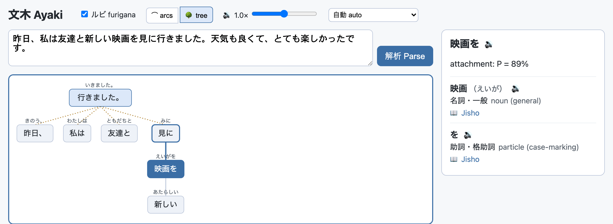
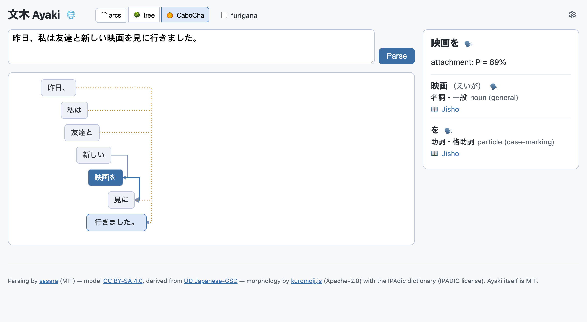

# 文木 Ayaki

A single-page browser app for exploring the structure of Japanese sentences.

Paste a Japanese sentence (or a whole paragraph) and Ayaki renders its bunsetsu-level
dependency tree as an interactive arc diagram (with a node-tree view and the classic
CaboCha-style stair view as alternatives).
Click any part of the sentence to inspect its morphemes — part of speech (Japanese term
with a gloss in the UI language), reading, base form — have words or whole sentences spoken
via the Web Speech API, and jump straight to [Jisho.org](https://jisho.org) for a word or
Google Translate for a sentence. The interface is available in English, German, Japanese
and Chinese (following the browser language by default, selectable via the globe in the header).

Everything runs client-side; there is no backend. Parsing is powered by
[sasara](https://github.com/iatosh/sasara) on top of
[kuromojin](https://github.com/azu/kuromojin) /
[kuromoji.js](https://github.com/takuyaa/kuromoji.js) with the IPAdic dictionary.

*Design documents live in [`docs/superpowers/specs/`](docs/superpowers/specs/).*

## Development

- `npm run dev` — dev server with hot reload.
- `npm test` — unit/component tests (vitest).
- `npm run check` — svelte-check (TypeScript across `.ts`/`.svelte`).
- `npm run build -- --base=/ayaki/` — production build into `dist/` (the `--base` must match
  the path the app is served from; GitHub Pages serves it under `/ayaki/`).
- `npm run smoke` — after a build, boots `vite preview` and drives headless Chromium
  (via Playwright) through a real parse to catch bundling breakage the unit suite can't see
  (kuromoji/zlibjs shims, asset paths, etc.). `vite preview` needs the *same* `--base` the
  build used, which is why the script always passes `--base=/ayaki/` itself. Any bump of
  `sasara`, `kuromojin`/`kuromoji.js`, or `vite` should never be merged without a green
  `npm run smoke` run — the CI build job runs it on every push.
- `npm run shots` — regenerates all three README screenshots via headless Chromium
  (builds first, so they are never stale). Run after any UI-visible change: every
  screenshot shows the app chrome, so a chrome change invalidates the whole set.
- `npm run live-check [-- <url>]` — post-deploy verification against production
  (default `https://saigyo.github.io/ayaki/`): boots the app, parses the example,
  exercises all three views and the language switcher, and fails on any console error.

## License

Ayaki itself is released under the [MIT License](LICENSE).

Ayaki builds on third-party components under their own licenses:

| Component | Use | License |
|---|---|---|
| [sasara](https://github.com/iatosh/sasara) © Satoshi Imamura | Bunsetsu dependency parser | [MIT](https://github.com/iatosh/sasara/blob/main/LICENSE) |
| sasara `model.json` | Parsing model, served as a static asset; derived from [UD Japanese-GSD](https://github.com/UniversalDependencies/UD_Japanese-GSD) (Megagon Labs) | [CC BY-SA 4.0](https://creativecommons.org/licenses/by-sa/4.0/) |
| [kuromojin](https://github.com/azu/kuromojin) © azu | Tokenizer wrapper (via sasara) | [MIT](https://github.com/azu/kuromojin/blob/master/LICENSE) |
| [kuromoji.js](https://github.com/takuyaa/kuromoji.js) © Atilika Inc. | Japanese morphological analyzer | [Apache-2.0](https://github.com/takuyaa/kuromoji.js/blob/master/LICENSE-2.0.txt) |
| IPAdic dictionary (bundled with kuromoji.js) | Morphological dictionary, served as static assets | [IPADIC license](https://github.com/takuyaa/kuromoji.js/blob/master/NOTICE.md) |

The deployed app serves the sasara model and the IPAdic dictionary files as static
assets, so the CC BY-SA 4.0 attribution/share-alike terms and the IPADIC notice apply to
redistributions of those files. The app's footer carries the same attributions.
